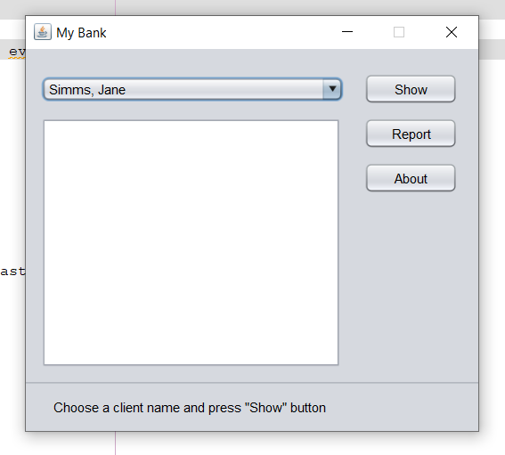
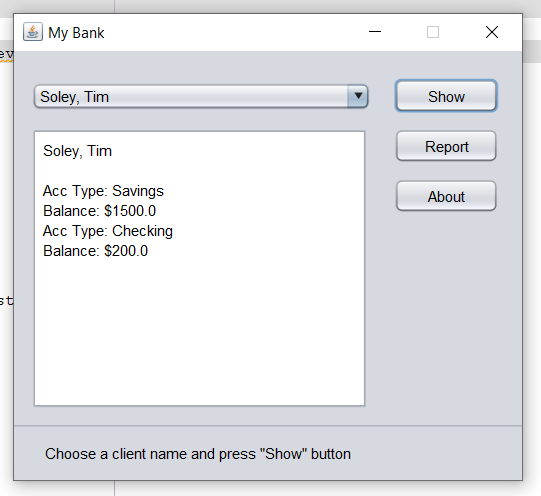
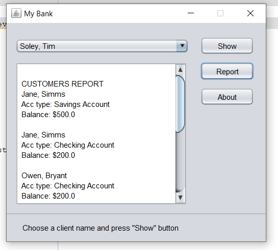
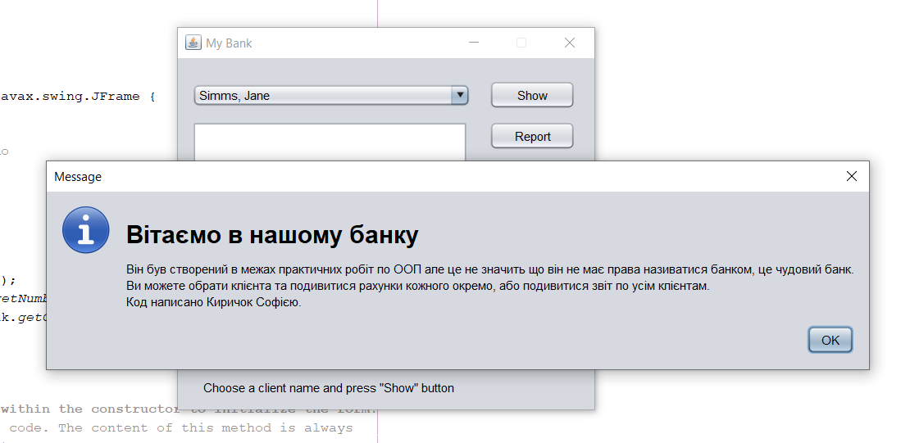

# UI Lab 4

## Завдання на 3, 4, 5

Вікно створено, клієнти з файлу читаються

Інформація виводиться

Репорт створюється

Віконечко з інформацією також є

---
**УВАГА! Не забуваємо здавати завдання через Google Classroom та вказувати посилання на створений для вас репозиторій!**

Також пам'ятайте, що ніхто не заважає вам редагувати файл README у вашому репозиторії😉.

 
